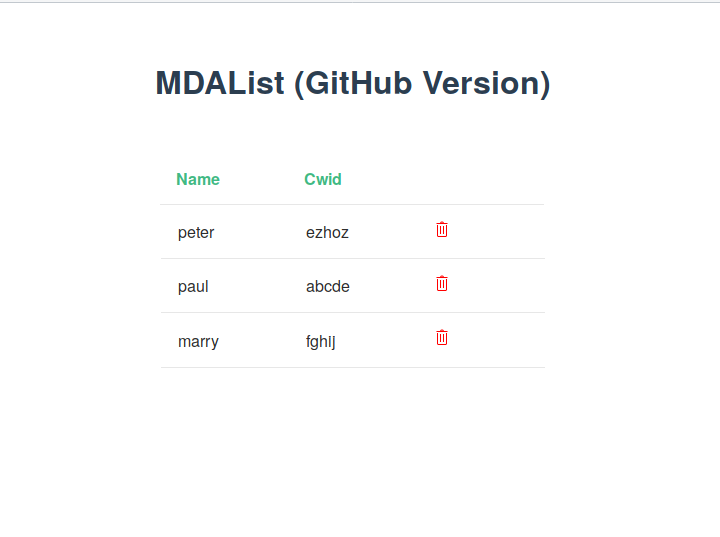

# MdaTable



## Demo

👉 [https://frosty-mclean-0a3909.netlify.com/](https://frosty-mclean-0a3909.netlify.com/)

## Quickstart 🚀

```sh
git clone git@github.com:bitworkers-official/MdaTable.git &&
cd mdatable &&
npm install &&
npm run dev
```
